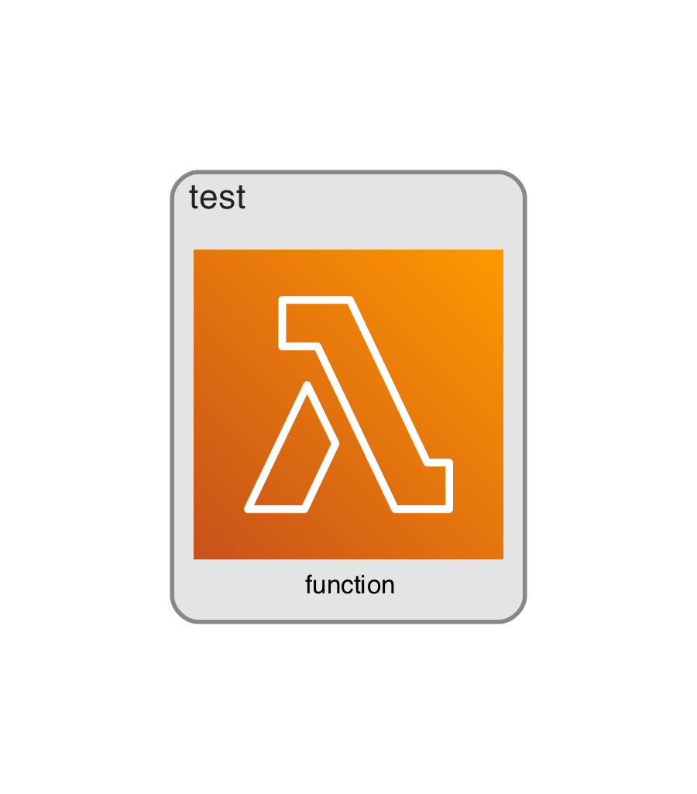

CDKでオレオレガードレールを実装する

# 構成



構成の出力には https://github.com/pistazie/cdk-dia を使わせて頂いてます！感謝！

# 準備

```
npm install
pip install -r requirements.txt
```

# 動作確認

```
# オレオレガードレールに怒られる
npx cdk -a "python3 app.py" synth

# オレオレガードレール対応した
npx cdk -a "python3 app2.py" synth
```
